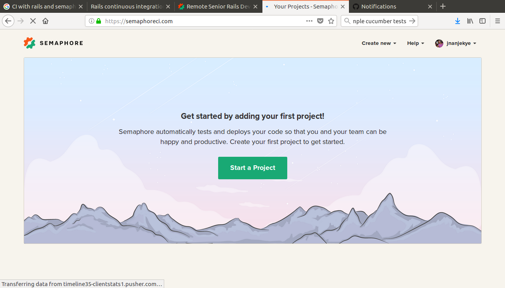
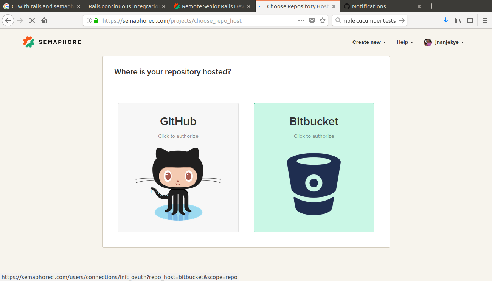
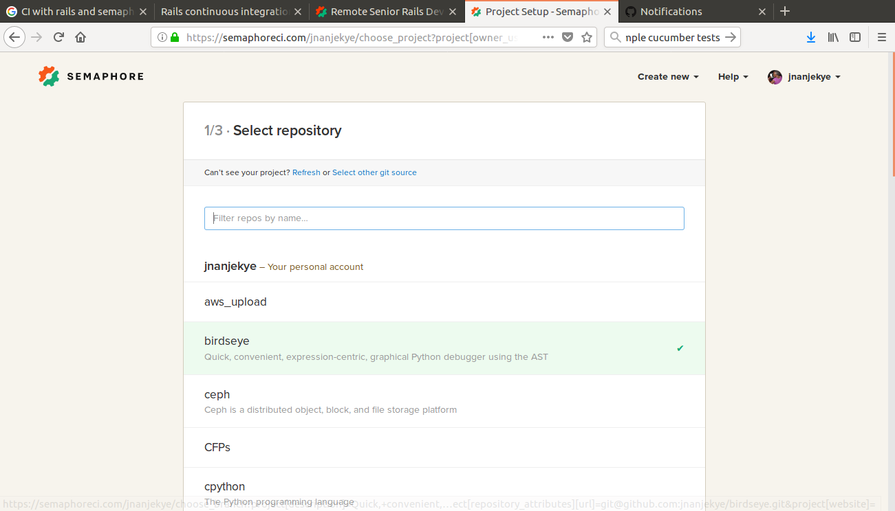
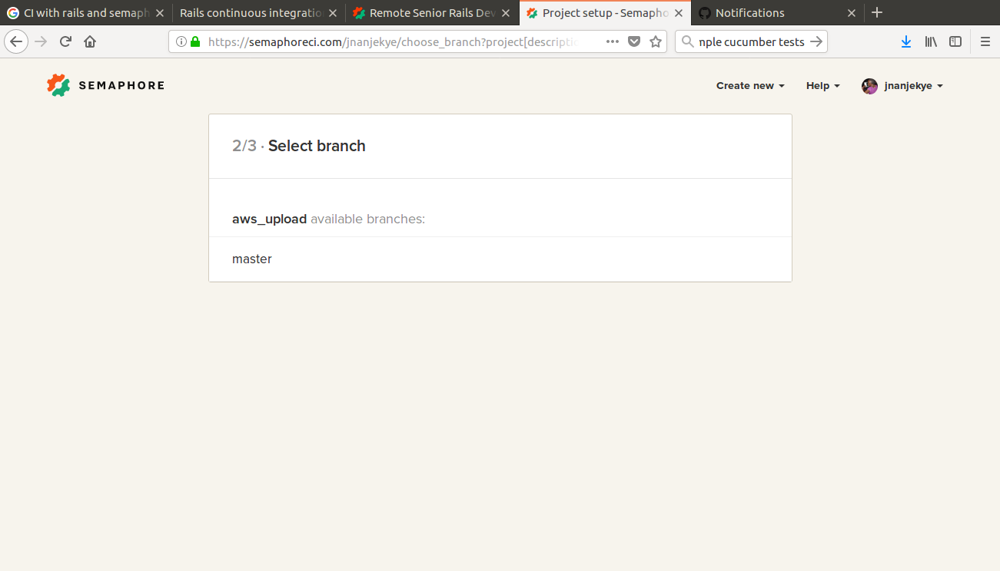
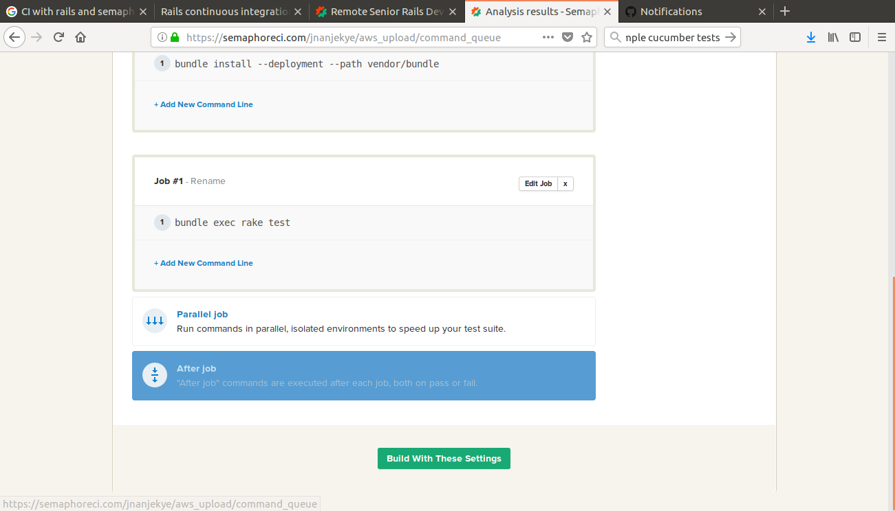
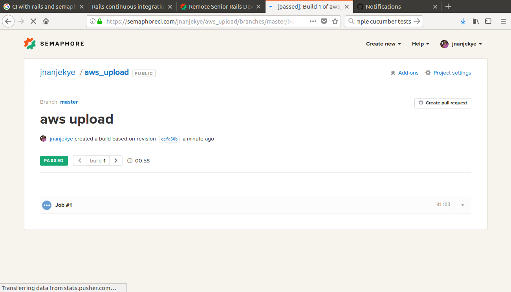

If you are a ruby developer, you have probably heard of or used Rails, a very popular ruby web framework to build web applications. Most companies require that their application data is stored in a way that it can be easily and securely stored, retrieved, and analyzed at scale and in which cases the application server hosting our rails application is not sufficient. In this case we need to opt for other alternatives like object storage where data is stored as objects. AWS S3 is object storage designed to store and retrieve data from any platform like our rails application. 

Before we deploy our application, we need to have some usability tests to ensure that our application works as required but also automate the last mile to deployment which is to ensure that for every commit,there is an automated pipeline to run all tests against the commit and report the status of the application with this commit update which is the goal of continous integration. We can go beyond this and create automation to deploy all commits that pass all tests a practice called continous deployment. There are many tools we can use to implement continous integeration but for purposes of this tutorial I will discuss how to achieve the same with an  CI tool called semaphore.

## Before we get started

Grab all the tools you may need to follow along this tutorial. If you do not yet have one of these and please follow the relevant guides to install.

+ [Ruby on Rails](http://installrails.com/)
+ A text editor of your choice like [sublime](https://www.sublimetext.com/3), [Atom](https://atom.io/) etc

### Setup AWS Account

To upload our artifacts to AWS S3, you will need to create an account with Amazon and get your credenatisls that we shall use for authentication. The credentails you need to take note of are:

+ AWS access key ID
+ AWS secret access key
+ AWS region

### Setup a Semaphore Account

Create an account on semaphore where we shall host our project on which we shall run tests on every commit for sanity checks.

## Uploading a file to AWS S3 with Rails

We are going to create a rails application that will have a feature of uploading a file of any type to AWS. We will make use pf the aws-sdk gem for this but before we do, lets create a new application

```rails new aws_upload```

### Get AWS gem

Edit the Gemfile and add the aws gem to it.

```# Gemfile
gem 'aws-sdk' ```

Run bundle install 

### AWS Configuration

In order to authorize our application to access s3 bucket you can pass the key and secret in a custom configuration file which is the most recommended. Create a yml file and call it config.yml in the config folder.

config.yml

```
development:
   aws:
    access_key_id: "key"
    secret_access_key: "secret"

production:
   aws:
    access_key_id: "key"
    secret_access_key: "secret"

test:
   aws:
    access_key_id: "key"
    secret_access_key: "secret"
```

This is a sample config. Use your specific AWS credentials. It is also recommended that you have separate configurations for different environments. Now create another file config.rb in the folder config/initializers and it shouls have logic to load our created configuration file.

config.rb

```
CONFIG = YAML.load_file("#{Rails.root.to_s}/config/config.yml")[Rails.env]

```

With this in place, we can now load our AWS config data using CONFIG[aws]

### Uploading to AWS s3

Now let us create the functionaity for uploading the file to s3 as a library. In the folder lib , create a file name it s3_lib.rb and this file shall hold our logic.

s3.rb

```
class S3Lib
  BUCKET = "aws-uploads".freeze

  def initialize file
    @file = file
    @s3 = AWS::S3.new
    @bucket = @s3.buckets[BUCKET]
  end

  def store
    @obj = @bucket.objects[filename].write(@file.tempfile, acl: :public_read)
    self
  end

  def url
    @obj.public_url.to_s
  end

  private
  
  def filename
    @filename ||= @file.original_filename.gsub(/[^a-zA-Z0-9_\.]/, '_')
  end
end

```
By placing this logic in a file under the lib folder,rails will autoload our library and we don’t need to write a separate require for it. 

let’s start by creat an  Artifact model with file field:

```

$ rails g scaffold Artifact title file
$ rake db:migrate

```

We have now to presign the request in the control.

```
class UsersController < ApplicationController
  def presign_upload
    # pass the limit option if you want to limit the file size
    render json: UploadPresigner.presign("/users/avatar/", params[:filename], limit: 1.megabyte)
  end
end

```

Add this to config/routes.rb

resources :users do
  collection do
    put :presign_upload
  end
end

Now let us implement the presigner class to work with s3.

# app/services/s3_presigner.rb

```
class UploadPresigner
  def self.presign(prefix, filename, limit: limit)
    extname = File.extname(filename)
    filename = "#{SecureRandom.uuid}#{extname}"
    upload_key = Pathname.new(prefix).join(filename).to_s

    creds = Aws::Credentials.new(ENV['AWS_ACCESS_KEY_ID'], ENV['AWS_SECRET_ACCESS_KEY'])
    s3 = Aws::S3::Resource.new(region: 'us-west-1', credentials: creds)
    obj = s3.bucket('yourproject').object(upload_key)

    params = { acl: 'public-read' }
    params[:content_length] = limit if limit

    {
      presigned_url: obj.presigned_url(:put, params),
      public_url: obj.public_url
    }
  end
end

```
This makes a request to AWS S3 API and returns presigned URL with token, which we will use on the client side. The S3 bucket must be configured to receive uploads from the browser.

Now let us create a form to take the file from the browser.

# app/views/artifacts/_form.html.erb

```

<div class="field">
  <%= f.label :file %><br>
  <%= f.hidden_field :avatar, class: "js-signed-upload-value" %>

  <input type="file" class="js-signed-upload" data-presign-url="<%= presign_upload_path %>" />

  <p class="js-signed-upload-status">
    <% if f.object.file.present? %>
    <a href="<%= f.object.file %>">File attached</a>
    <% end %>
  </p>
</div>


```

Add the necessary Joavascript to achieve the above.

# app/assets/javascripts/users.coffee

```
uploadWithUrl = (form, file, presignedUrl, publicUrl) ->
	# disable submit while uploading and update status
  submit = form.find("input[type='submit']").attr('disabled', true)
  $('.js-signed-upload-status').text('Uploading...')

  # create PUT request to S3
  xhr = new XMLHttpRequest()
  xhr.open 'PUT', presignedUrl
  xhr.setRequestHeader 'Content-Type', file.type

  xhr.onload = ->
    submit.removeAttr('disabled')
    if xhr.status == 200
      $('.js-signed-upload-value').val(publicUrl)
      $('.js-signed-upload-status').text('')

  xhr.onerror = ->
    submit.removeAttr('disabled')
    $('.js-signed-upload-status').text('Failed to upload. Try uploading a smaller file.')

  xhr.send file
  return

upload = (form, file, url) ->
  # before actually uploading the file, we need to ask controller for a token
	$.ajax(
		url: url + '?filename=' + file.name + '&filetype=' + file.type,
		method: 'PUT',
		accept: 'json'
	).success((data)->
    # pass presigned public urls to the function to actually upload it
		uploadWithUrl form, file, data.presigned_url, data.public_url
	)

uploadHandler = (field)->
  file = field.files[0]
  if file == null
    return

  form = $(field).parents("form").eq(0)
  upload(form, file, field.dataset.presignUrl)

$ ->
  $('.js-signed-upload').change ->
    uploadHandler(this)

```

Now when the page is ready, start rails server and open the /users/new in your browser. Enter some name and choose an avatar. After you submit the form, controller will redirect you to the show action. Let’s improve it a bit to display the link to attachment:

# app/views/artifacts/show.html.erb
[...]
<% if @artifact.file %>
<p>
  <strong>Avatar:</strong>
  <%= link_to image_tag(@artifact.avatar), @artifact.avatar %>
</p>
<% end %>
[...]

Now all user uploads in your app are processed directly to AWS S3, without causing any extra load on the backend.


## Testing the Application with Cucumber

we're using Cucumber as a tool for writing our acceptance tests. The workflow of implementing acceptance tests is follows;


+ Write your acceptance test
+ See it fail so you know what the next step is
+ Write a unit test for that next step
+ See it fail so you know what the implementation needs to be
+ Repeat steps 3 and 4 until you have everything you need, and all your tests (including the acceptance one) are passing
+ Rinse and repeat for every new feature.

Now let us first create a cucumber feature for our application.

# feature/aws_cucumber.feature
Feature: AWS index
As a product manager
I want our users to be greeted when they visit our site
So that they have a better experience

Scenario: User sees the welcome message
When I go to the homepage
Then I should see the welcome message

Next we write the ruby code to execute each step in the above feature description.

# feature/aws_steps.rb

When(/^I go to the homepage$/) do
  visit root_path
end

Then(/^I should see the welcome message$/) do
  expect(page).to have_content("Welcome to AWS file upload")
end

There are many scenarios we can implement to test our application. This is just a simple example.

Now point the routes to the new controller.

# config/routes.rb
Rails.application.routes.draw do
  root 'artifact#new'
end

Run the tests

$ cucumber -s

You should have an output like this :

Using the default profile…
Feature: Hello Cucumber

  Scenario: User sees the welcome message
      When I go to the homepage
      Then I should see the welcome message

1 scenario (1 passed)
2 steps (2 passed)
0m0.168s

Ensure you implement the features required to successfully pass the tests.

## Continous Integration with Semaphore

Create a repository on either github or bitbucket and push the changes to it. The next step is for us to add this remote repository to semaphore. Login to semaphore and click start project:



Select where your project is hosted either github or bitbucket.



Choose the project you pushed.



Choose what branch you want to do CI on.



You can now add any commands that the semaphore CI should run



This case just add.

cucumber -s 

In addition to the default.

Semaphore will then build your branch on every commit.




